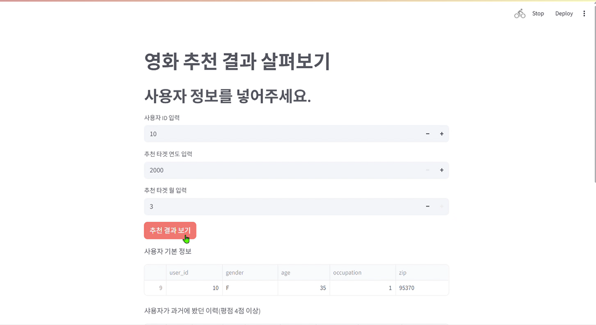
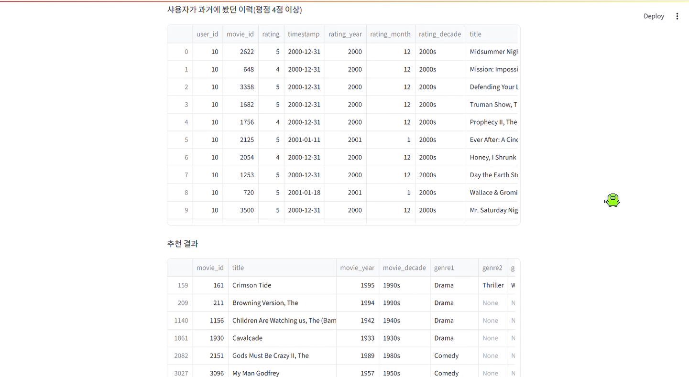

# 🔍 AutoInt+ 모델 성능 개선 실험 요약

AutoInt+ 모델의 성능 향상을 위해 총 2가지 실험을 진행하였으나,  
**Baseline 대비 모두 성능이 저하되는 결과**를 얻었다. 

---

## ⚙️ 실험 구성 비교

| 파라미터          | Baseline     | Try 1 (구조 확장)       | Try 2 (Dropout 조정)   |
|-------------------|--------------|--------------------------|------------------------|
| 어텐션 헤드 수    | 2            | 🔺 4                      | 2                      |
| DNN 구조          | (32, 32)     | 🔺 (64, 32, 16)           | (32, 32)               |
| 배치 정규화       | ❌ False     | ✅ True                  | ❌ False               |
| 드롭아웃          | 0.4          | 🔽 0.3                    | 🔽 0.3                 |

---

## 📊 성능 지표 (예시)

| 실험 버전 | NDCG     | HitRate  | 비고                            |
|-----------|----------|----------|---------------------------------|
| Baseline  | 0.66202  | 0.63058  | 기본 구조, 균형된 성능          |
| Try 1     | 0.55717  | 0.57051  | 복잡도 증가 → 성능 저하         |
| Try 2     | 미기재   | 미기재   | 드롭아웃만 조정, 유의미한 변화 없음 |

---

## 🧠 결론

- **Try 1:** DNN 확장, 정규화 적용 등 구조를 복잡하게 만들었지만 오히려 성능 하락
- **Try 2:** 단일 하이퍼파라미터(dnn_dropout) 조정만으로는 성능 개선 어려움
- **Baseline이 여전히 가장 안정적인 성능**을 보였으며, 향후에는 더욱 정교한 튜닝 또는 구조적 개선이 필요함

---

## 🎥 Streamlit 시연 결과

아래는 사용자 ID와 추천 조건(연도/월)을 입력한 뒤, 영화 추천 결과를 확인하는 Streamlit 인터페이스 시연 화면입니다.

  
  

